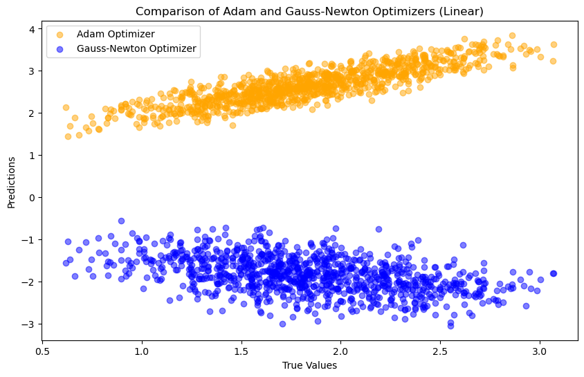
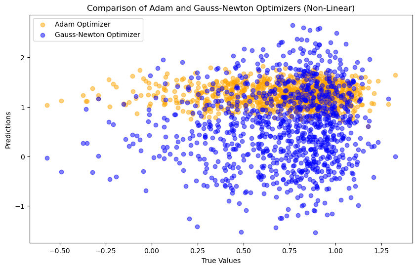
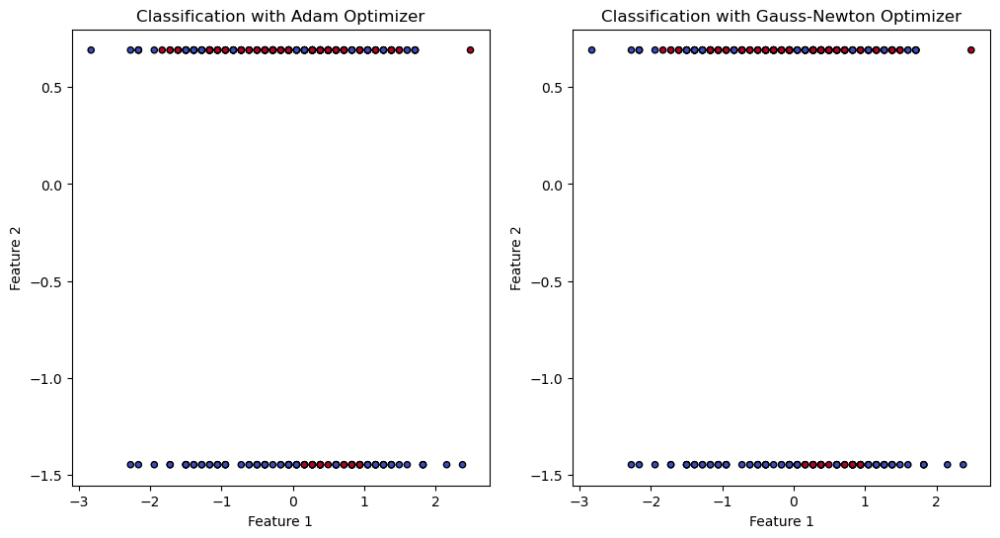

# Bayesian_Neural_Networks
DSC 210 - FALL 2023 - Course Project
### Course: DSC 210: Numerical Linear Algebra 
### Instructor: [Dr. Tsui-Wei (Lily) Weng](https://lilyweng.github.io/)

## Overview

### Project Background

This project explores the optimization of Bayesian Neural Networks (BNNs) using the Gauss-Newton Algorithm, comparing it with the standard Adam Optimizer. Our focus is on enhancing BNN performance in linear and non-linear regression, and classification scenarios.

### Objectives

- **Regression Analysis**: Utilize datasets with 1000 random data points and 10 features to evaluate optimizer performance in linear and non-linear regression.
- **Classification**: Implement the UCI Machine Learning Repository's "Heart Disease Dataset" ([link](https://archive.ics.uci.edu/ml/machine-learning-databases/heart-disease/processed.cleveland.data)) to assess optimizer efficacy in classification tasks.

This concise overview encapsulates our approach to improving BNN optimization techniques. For detailed information and methodology, please refer to our comprehensive [Notion documentation](https://aquatic-lettuce-a1e.notion.site/Optimizing-Bayesian-Neural-Network-using-Gauss-Newton-Algorithm-aad4589adf6845dcb35877d9ab3f8135?pvs=4).

## Instructions:
### Python Installation

To run this project, you need to have Python 3.11 installed. Follow these steps to install Python 3.11:

1. Download Python 3.11 from the official website: [Python Downloads](https://www.python.org/downloads/).
2. Follow the installation instructions for your specific operating system.
3. Verify the installation by running `python --version` in your command line or terminal. It should output `Python 3.11.x`.

### Setting Up a Python 3.11 Kernel in Jupyter Notebook

After installing Python 3.11, you can set it up as a kernel in Jupyter Notebook:

1. First, ensure you have Jupyter Notebook installed. If not, install it using pip:
```python
pip install notebook
```
2. Install `ipykernel` package:
```python
pip install ipykernel
```
3. Add Python 3.11 as a new kernel:
```python 
python -m ipykernel install --user --name=python3.11
```
4. Now, you can select Python 3.11 as the kernel in your Jupyter Notebook.

### Installing Dependencies

To install required dependencies, use the `requirements.txt` file:

```bash
pip install -r requirements.txt 
```
Once all the dependencies are installed, then you can run all the cells in the Jupyter Notebook.
## Results
 **Important Notice:** Please be aware that the results and outputs generated by the code may vary with each execution. The values and outcomes presented in this document are based on a previous run and are subject to change in subsequent runs. This variability should be taken into consideration when reviewing the project's outputs.
### Linear Setup 
Adam Optimizer:
Mean Squared Error: 0.7339672156228962
Gauss-Newton Optimizer:
Mean Squared Error: 14.028202396630801


### Non Linear Setup 
Adam Optimizer:
Mean Squared Error: 0.41180645749024436
Gauss-Newton Optimizer:
Mean Squared Error: 0.6607373959839795


### Classification Setup
Accuracy with Adam Optimizer: 0.8013468013468014
Accuracy with Gauss-Newton Optimizer: 0.6767676767676768



